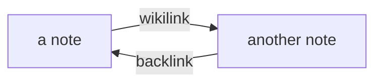

# Getting Started

Welcome to Verso. Here's how the pieces fit together.

## Writing

- Type in **blocks**. Use Markdown shortcuts: `# ` for a heading, `- ` for a bullet,
  `[] ` for a todo, ` ``` ` for code, and `/table` for a table.
- Press **Enter** on an empty bullet to step back out of a list.
- Link notes with `[[wikilinks]]` — type `[[` for autocomplete. Cmd/Ctrl-click a link
  to open it in a new tab.
- Paste or drop an image straight into a note — it's saved under `assets/` and shown inline.

## Diagrams

Tag a code fence `mermaid` and it renders as a diagram — click it to edit the source, or
start a new one with `/mermaid`.



## Quotes and callouts

Start a line with `>` for a blockquote:

> Writing is thinking. To write well is to think clearly.

Name a kind on the first line and it becomes a callout — `/callout` inserts one:

> [!tip] Twelve kinds are built in
> note, abstract, info, tip, success, question, warning, failure, danger, bug,
> example and quote — each with its own colour.

> [!warning]- Add a `-` to start it collapsed
> Handy for asides you don't want in the way. Click the header to open it.

## Math

Inline math like $a^2 + b^2 = c^2$ goes between single `$`, and display math between
double — `/math` inserts a block:

$$\int_{-\infty}^{\infty} e^{-x^2}\,dx = \sqrt{\pi}$$

Prices are safe: "it costs $5 and $10" stays prose.

## Todos

Write a checkbox anywhere: 

- [ ] Try the Todos page (the ✓ button) @2026-06-20
- [ ] Todos written in a daily note are scheduled for that day

The **Todos** page gathers every task across the vault, sorted by date. Overdue ones
surface on today's journal page.

## Journal

Click **☼ Journal** for an infinite scroll of daily notes, with a calendar to jump around.

## Properties & Templates

Open the **Properties** panel on the right. Set a note's **Type** (try `Book`) and its
template properties fill in automatically. Types live in the `type/` folder.

## Backlinks

Every note lists its [[Welcome]] references at the bottom — hover one to edit the source
text inline.

#getting-started
